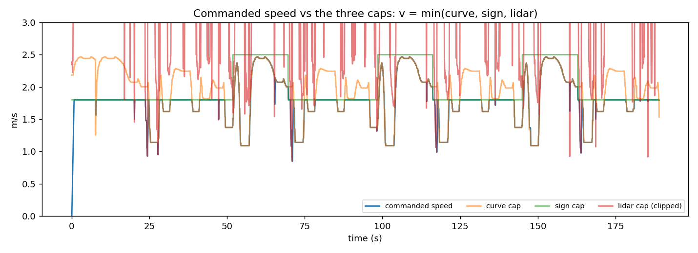

# MuSHR Vision-Aware Autonomous Racing

Team stack for the 5-day MuSHR racing challenge: a six-node ROS 1 system
that completes **3 consecutive autonomous laps (best flying lap 46.5 s,
zero collisions)**, brakes for corners it hasn't reached yet, reads ArUco
speed signs from a camera, dodges LiDAR-visible obstacles, and reverses
itself out of deadlocks — all verified on four track configurations with
logged evidence.


*The whole system in one picture: commanded speed (blue) riding
`min(curvature cap, sign cap, LiDAR cap)` across three laps. Green steps =
speed-limit signs read live from the camera; red spikes = obstacles.*

## Results (official logged runs)

| Map | Laps | Best flying lap | Collisions |
|---|---|---|---|
| Development | 3 | **46.5 s** (46.6 s repeat) | 0 |
| Evaluation A (unseen) | 2+ | 63.2 s — 60% of run in SLOW zones | 0 |
| Evaluation B (unseen, obstacle on racing line) | 2+ | 68.6 s | 0 |
| Evaluation C (unseen) | 2+ | 80.9 s | 0 |

Sign detection: 2/2 confirmations per lap with 0 false transitions —
including under darkening (−70 brightness) and 7 px Gaussian blur.

More figures in [docs/figures/](docs/figures/): speed profile, tracking
error (≤0.24 m), obstacle clearance.

## How it works (short version)

Six nodes, one rule — **everyone publishes opinions, only the arbiter
drives**: Pure Pursuit proposes steering; a curvature planner, the sign
detector, and the LiDAR safety node each propose a speed ceiling; the
arbiter commands `v = min(all three)` with rate limits, blends in the
obstacle-dodge by urgency, and runs the stuck→reverse→resume recovery
state machine. Full explainer with design rationale:
[submission_docs/ARCHITECTURE.md](submission_docs/ARCHITECTURE.md).

## Documents

| Doc | What's in it |
|---|---|
| [submission_docs/REPORT.md](submission_docs/REPORT.md) | The ≤5-page submission report |
| [submission_docs/ARCHITECTURE.md](submission_docs/ARCHITECTURE.md) | System explainer + all figures |
| [submission_docs/BUILDLOG.md](submission_docs/BUILDLOG.md) | Step-by-step engineering log: every design decision, measurement, and war story |
| [submission_docs/RUNBOOK.md](submission_docs/RUNBOOK.md) | Exact commands: start, stop, demos, health check |

## Quickstart

Prereqs: Docker Desktop, [Foxglove Studio](https://foxglove.dev/download).

```bash
cd sim && docker compose up -d

# first time only: build the workspace (~1 min)
docker exec mushr_sim bash -c 'source /opt/ros/noetic/setup.bash && cd /root/catkin_ws && catkin build'

# start the simulator (applies compatibility patches automatically,
# refuses to double-start)
docker exec -d mushr_sim bash /assignment/sim/scripts/start_sim.sh track_development development

# ALWAYS: 10-second drivetrain health check before trusting a run
# (command in RUNBOOK.md — car must physically move)

# launch the racing stack (all six nodes + logger)
docker exec -d mushr_sim bash -c 'source /opt/ros/noetic/setup.bash && source /root/catkin_ws/devel/setup.bash && roslaunch race_stack race.launch run_name:=myrun'
```

Watch in Foxglove: Open connection → **Rosbridge** → `ws://localhost:9090`.
Every run writes a 20 Hz CSV to `logs/`; turn it into plots + lap times
with `python3 race_stack/scripts/make_plots.py logs/<run>.csv`.

## Repo layout

| Path | What it is |
|---|---|
| `race_stack/` | The racing stack: 7 nodes, launch file, `config/params.yaml` |
| `submission_docs/` | Report, architecture, build log, runbook |
| `results/` | CSVs of the official runs behind the results table |
| `docs/figures/` | Report/slide figures · `docs/` also holds the assignment handout |
| `testing/` | The prototypes that came first (drive straight → stop at wall → Pure Pursuit → speed laws) — the try-it-small trail the BUILDLOG narrates |
| `sim/` | Simulation environment: Docker setup, sim launcher, synthetic sign camera, obstacle-map baking, upstream patches |
| `track/`, `config/`, `signs/` | Instructor-provided assets (unmodified) |

## Why this setup (the short answer)

ROS 1 Noetic + the official MuSHR simulator in Docker: the assignment
requires an Ackermann vehicle and names MuSHR; the official sim provides
the correct car, LiDAR, and drive interface out of the box, so all our
time went into the graded work. The camera is synthetic (stock mushr_sim
has none): it renders the real ArUco board textures with true perspective
projection, so OpenCV detection behaves realistically — the handout
explicitly expects such an adapter. Obstacles are baked into map variants
so LiDAR genuinely sees them. Full rationale in the ARCHITECTURE doc.
