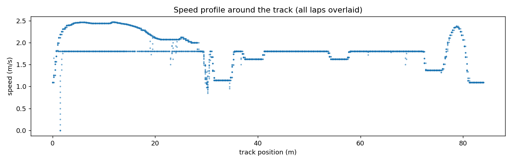
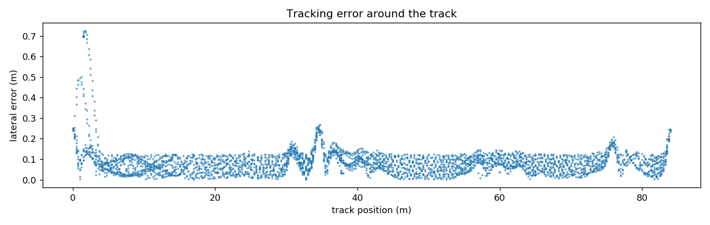
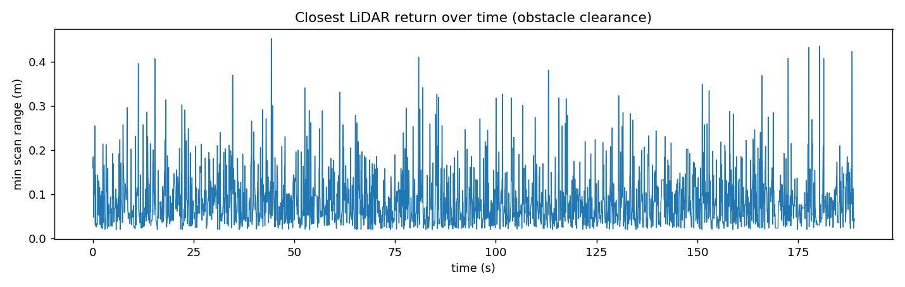
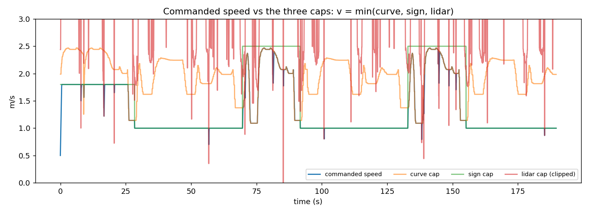

# MuSHR Vision Racing — Complete System Explainer

The single document to read before the presentation: how the stack works,
why it's designed this way, the measured results, and the figures (in
`../docs/figures/`, drag them straight into slides). Deep dives per step live
in [BUILDLOG.md](BUILDLOG.md); run commands in [RUNBOOK.md](RUNBOOK.md).

## The architecture in one picture

```
                    track/centerline_waypoints.csv
                              │
              ┌───────────────┼────────────────┐
              ▼               ▼                ▼
      waypoint_manager   path_follower   speed_planner
      (where am I?)      (steering)      (how fast here?)
              │               │                │
   /race/nearest_waypoint  /race/pp_steer  /race/curve_speed_cap
   /race/progress_m           │                │
   /race/lap_count            ▼                ▼
  camera ─► sign_detector ─► /race/sign_speed_cap ─►┌─────────┐
  lidar  ─► lidar_safety  ─► /race/lidar_speed_cap ─►│ arbiter │─► /drive
                          ─► /race/dodge_steer     ─►└─────────┘
                                                        │
                                          /race/state, /race/target_speed
                                          (race_logger records everything)
```

Six nodes, one rule: **everyone publishes opinions; only the arbiter
drives.** That is why the min() rule is enforceable, why a crashed node
degrades gracefully, and why four people could build in parallel against
the topic contract.

## Node by node

### waypoint_manager — the trip computer
Loads the 337 centerline points once; per odometry tick (20 Hz) a single
vectorized argmin finds the nearest waypoint; a precomputed cumulative
distance table converts index → metres of progress. Lap counting uses
**hysteresis**: a lap counts only when the nearest index jumps from the
last 10% of the track into the first 10% — noise or wobbling on the line
cannot fake it; a backwards crossing decrements. Publishes the centerline
as a Marker so Foxglove shows the racing line.
*Principle: state transitions require unambiguous evidence.*

### path_follower — Pure Pursuit
Chase a "carrot" 1.2 m ahead along the centerline. Transform it into the
car frame, get bearing alpha, then one line of circle geometry:
`steer = atan(2·L·sin(alpha)/d)` — the unique arc through the carrot for
a car with wheelbase L. No PID, no integral state: the controller's only
"memory" is the car's position on the track, so it self-recovers from any
disturbance (teleport the car mid-lap — it just re-acquires the line).

### speed_planner — the track sets the pace
Curvature at each waypoint from the CSV's own headings (kappa = heading
change per metre of arc), the handout's law `v = v_max/(1+k·|kappa|)`,
and the crucial twist: the cap at each waypoint is the **minimum over the
next 3 m**, so braking happens *before* corners. Precomputed at startup;
runtime is an array lookup driven by `/race/nearest_waypoint`.
This predictive planner replaced our reactive prototype (speed from
carrot bearing) and measured decisively better: it brakes on entry, not
mid-corner.

### sign_detector — rules from pixels
`cv2.aruco.detectMarkers` (DICT_4X4_50) finds boards; ArUco decodes a
binary grid, so false positives are near-impossible by construction. Our
filtering: ignore unknown IDs and sub-400 px² (too far) markers, largest
marker wins if several are visible, and a sign becomes *active* only
after **3 consecutive frames** — then it latches until a different sign
is confirmed (assignment zone semantics: passing the board does not end
the zone). Publishes the active sign and its speed cap (10→1.0, 20→1.8,
30→2.5 m/s), default NORMAL before any sign.

### lidar_safety — the reflexes
720 rays → three robust numbers: 10th-percentile clearance in a ±7°
center cone and two 11–40° side windows. Percentile, never min: the
(realistic) laser noise model produces phantom single-ray shorts — a
percentile ignores liars, a real obstacle spanning dozens of rays
dominates instantly. Outputs:
- **Speed cap**: linear ramp — no opinion above 2.5 m clearance, zero at
  0.45 m. The e-stop is the bottom of the ramp, not a separate mode.
- **Dodge**: direction = freer side window, magnitude grows with urgency
  (0 at 2.2 m → max at 0.45 m), capped at 0.2 rad so the dodge alone can
  never steer the car off-track.
Thresholds are measured, not guessed: the center cone was ±11° until data
showed it grabbing track walls (cap stuck ~1.9 on open straights); 0.45 m
= car length + laser offset + one control tick at top speed.

### arbiter + recovery — the only node that drives
At 20 Hz: `speed = min(curve, sign, lidar)`, rate-limited (2.5 m/s² up,
3.0 down) for physically smooth commands. Steering blends Pure Pursuit
with the dodge by urgency `u = |dodge|/0.2`:
`steer = (1-u)·pp + sign(dodge)·u·max_steer` — at full urgency the dodge
receives FULL authority. That one line fixed the evaluation-B deadlock.
Recovery FSM: not moving for 2 s while commanding motion **or pinned by
the e-stop** → reverse 1.8 s, nose swinging toward free space → resume.
(The "or pinned" clause was a bug fix found in testing: during a full
e-stop, commanded speed is 0, so a naive cmd>0 condition made recovery
unreachable exactly when it was needed most.)

### race_logger + make_plots — the witness
20 Hz CSV of every submission-checklist column; `make_plots.py <csv>`
produces the four figures below plus lap times. On its very first run it
caught a dead sim drivetrain (car commanded 1.1 m/s, position frozen) —
the case study for why logging is part of the stack, not an afterthought.

## Results (official logged runs, final tuning)

| Map | Laps | Best flying lap | Notes |
|---|---|---|---|
| Development | 3 | **46.5 s** (46.6 repeat) | zero collisions |
| Evaluation A | 2+ | 63.2 s | 60% of run in SLOW zones; sign cap binding 72% of samples — pace is regulation, not tuning |
| Evaluation B | 2+ | 68.6 s | on-line box dodged every lap; recovery never needed |
| Evaluation C | 2+ | 80.9 s | SLOW-capped most of lap |

### Vision robustness (required perturbation test)

| Condition | Confirmations | False transitions |
|---|---|---|
| Baseline | 2/2 | 0 |
| Brightness −70 | 2/2 | 0 |
| Gaussian blur 7 px | 2/2 | 0 |

## Figures (../docs/figures/ — use these in the slides)

**The arbiter picture** — commanded speed hugging min(curve, sign,
lidar); green sign-cap steps are BOOST zones, red spikes are obstacles:


**Speed profile by track position** (all laps overlaid — repeatability is
the tight vertical spread):



**Tracking error around the track** (Pure Pursuit quality; peaks are
corner apexes and the dodge around the barrel):



**Obstacle clearance over time** (min LiDAR return; the periodic dips are
the barrel/gate passes — never below the 0.45 m stop threshold):



**Evaluation A: racing by the rules** — long 1.0 m/s plateaus are SLOW
zones read from the track, not hard-coded:



## The three Q&A stories

1. **"Why no PID?"** Steering is model-based geometry (kinematics are
   known — compute, don't regulate); speed tracking belongs to the VESC
   layer beneath us; our layer contributes explicit acceleration limits.
2. **The evaluation-B saga.** Obstacle dead on the racing line → safe
   freeze (bounded dodge loses to Pure Pursuit *by design*) → fixed with
   urgency-weighted authority transfer in the arbiter → re-tested: passes
   with zero recoveries; recovery separately demonstrated as backstop.
   A failure found by systematic testing, root-caused, fixed
   architecturally, re-verified.
3. **Pace is legality.** 46.5 s on dev vs 63.2 s on eval A — and we can
   prove the difference is the sign zones (60% SLOW occupancy, cap
   binding 72% of samples). Nothing is tied to waypoint numbers; the car
   reads its speed limits off the walls.
