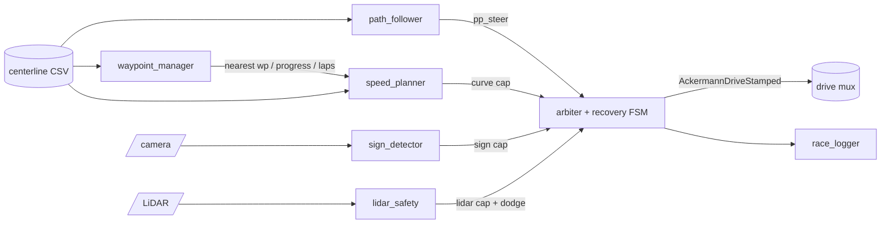

# MuSHR Vision-Aware Autonomous Racing — Team Report

*Team mushr-vision-racing · repository:
github.com/vedcoder/mushr-vision-racing · August 2026*

*(≤5 pages when exported. Figures: `../docs/figures/`. Reproduction:
`README.md` + `RUNBOOK.md`. Per-step engineering log: `BUILDLOG.md`.)*

## 1. System overview

Our stack completes three consecutive autonomous laps while following the
supplied centerline, planning speed from track curvature, obeying ArUco
speed-zone signs, avoiding LiDAR-visible obstacles, and recovering from
immobilization without manual intervention. It is a ROS 1 (Noetic)
package of six nodes running against the official MuSHR simulator in
Docker; a seventh node logs every run to CSV.

The architectural rule is single drive authority: every node publishes an
*opinion* (a steering suggestion or a speed ceiling) and only the arbiter
commands the vehicle, computing v = min(v_curve, v_sign, v_lidar) with
acceleration limits, and a steering blend described in §4.

## 2. Path following and speed planning

**Pure Pursuit.** The follower chases a lookahead point 1.2 m ahead on
the centerline: with bearing α to that point and wheelbase L = 0.33 m,
steering δ = atan(2L·sin α / d), clamped to the ±0.34 rad servo limit.
Lookahead was tuned empirically: 0.6 m oscillates, 2.5 m cuts corners;
1.2 m held lateral error ≤ 0.24 m at all tested speeds (Fig.
`finalDev_tracking_error`). Should lookahead scale with speed? Ideally
yes; at our speed range (≤2.5 m/s) a fixed value proved sufficient, and
we prioritized fewer coupled parameters.

**Curvature.** From the waypoint file's own headings: κᵢ =
wrap(yaw_{i+1} − yaw_{i−1}) / (s_{i+1} − s_{i−1}), i.e. heading change
per metre of arc — robust to the slightly uneven 0.25 m spacing.

**Speed law.** v = clip(v_max/(1 + k·|κ|), 0.9, 2.5) with k = 0.8, and
the cap at waypoint i is the *minimum over the next 3 m* so the car
brakes before corners. We first prototyped a reactive law (speed from
carrot bearing); it lapped but braked measurably late — the predictive
planner plus tuning improved the legal flying lap from ~49 s to 46.5 s.
Commands are rate-limited (+2.5 / −3.0 m/s²) for smoothness.

## 3. Vision: sign detection

OpenCV ArUco (DICT_4X4_50) per frame, then: unknown IDs ignored; markers
under 400 px² ignored (too distant to act on); largest marker wins; and a
marker becomes the *active sign* only after 3 consecutive frames. The
active sign then latches until a different sign is confirmed, per the
zone semantics. Speed caps: 10→1.0, 20→1.8, 30→2.5 m/s; NORMAL before
any sign. Every detection is logged with timestamp and pixel area (our
confidence proxy).

**False-positive rejection** (report question): three mechanisms —
ArUco's binary decoding (a candidate must decode to a valid dictionary
codeword), the area threshold, and temporal confirmation. Duplicate
observations are absorbed by the latch (re-seeing the active sign is a
no-op).

**Robustness** (required perturbation test, one lap each):

| Condition | Confirmations | False transitions |
|---|---|---|
| Baseline | 2/2 | 0 |
| Brightness −70 | 2/2 | 0 |
| Gaussian blur 7 px | 2/2 | 0 |

## 4. LiDAR safety, avoidance, and recovery

Each 360° scan reduces to three clearances — a ±7° centre cone and
11–40° side windows — using the 10th percentile, never the minimum,
because the sensor model produces phantom single-ray short returns (we
triggered a false stop from one such ray in early testing). The centre
cone was ±11° until data showed it capturing the walls of the 2.3 m
track (cap pinned ≈1.9 on open straights); ±7° fixed this.

**Speed cap:** linear ramp from unconstrained at 2.5 m clearance to zero
at 0.45 m — the emergency stop is the bottom of the ramp, not a separate
mode. The 0.45 m threshold = car length + laser mounting offset + one
50 ms control interval at 2.5 m/s.

**Avoidance:** below 2.2 m centre clearance a dodge bias grows toward
the freer side window (max 0.2 rad — deliberately below Pure Pursuit's
authority so the dodge alone can never leave the track). The arbiter
blends by urgency u = |dodge|/0.2: steer = (1−u)·δ_PP +
sign(dodge)·u·δ_max, granting the dodge full authority only as clearance
approaches stopping distance.

**Recovery:** if the car has not moved for 2 s while commanding motion
*or* while pinned by the e-stop, the FSM reverses 1.8 s at 0.6 m/s with
steering chosen to swing the nose toward free space, then resumes.
Demonstrated by teleporting the car 0.3 m from an obstacle: logged
RACING → REVERSING → RACING, after which it completed the lap. (An
earlier version required commanded speed > 0 to declare "stuck," which a
full e-stop makes impossible — recovery was unreachable in exactly the
deepest deadlock. Found in testing, fixed.)

## 5. Evaluation

Official logged runs (20 Hz CSV; plots via `make_plots.py`):

| Map | Laps | Best flying lap | Collisions | Notes |
|---|---|---|---|---|
| Development | 3 | **46.5 s** (46.6 repeat) | 0 | Fig. speed_caps/profile |
| Evaluation A | 2+ | 63.2 s | 0 | 60% of run in SLOW zones |
| Evaluation B | 2+ | 68.6 s | 0 | on-line box dodged every lap |
| Evaluation C | 2+ | 80.9 s | 0 | SLOW-capped most of lap |

**Which constraint limits speed?** (report question) Instrumented
answer: on the development map the curvature cap binds in corners and
the sign cap on straights; on evaluation A the sign cap bound 72% of
samples (60% SLOW-zone occupancy) — the pace differences between maps
are regulation, not tuning. The LiDAR cap binds only near obstacles
(by design).

## 6. Failure modes and limitations

- **On-line obstacles** initially produced a safe deadlock (no
  collision, no progress): the bounded dodge cannot out-vote Pure
  Pursuit aiming through an obstacle. Fixed architecturally with the
  urgency blend; the FSM remains as backstop. Evaluation B now passes
  with zero recoveries.
- **Sign sightlines:** one dev-layout sign (SLOW) is ~90° off the camera
  axis from the racing line and is never observed while driving; we
  verified the detector reads it when in view. A wider FOV was tested
  and rejected with data (fewer px/deg lost a previously-detected sign).
- **Forward-only safety:** clearance windows cover ±40°; side or rear
  contact is invisible to the safety node. Acceptable for forward
  racing; a limitation regardless.
- **Ground-truth odometry** is used in development (switchable by
  parameter); localization error handling is untested.

**What single change would most improve lap time without reducing
safety?** (report question) Speed-dependent lookahead plus a racing-line
optimizer (corner-cutting within track bounds): the largest remaining
time cost is centerline-faithful cornering; both changes attack it
without touching safety caps.

## 7. Reproducibility

One-command environment (Docker + named volume), one launch file
(`roslaunch race_stack race.launch run_name:=X`), all parameters in
`race_stack/config/params.yaml`, every run producing a CSV and four
plots. RUNBOOK.md contains exact start/stop/demo commands including the
pre-run drivetrain health check.

## Appendix A — team contributions

*(To be completed by the team before submission.)*
